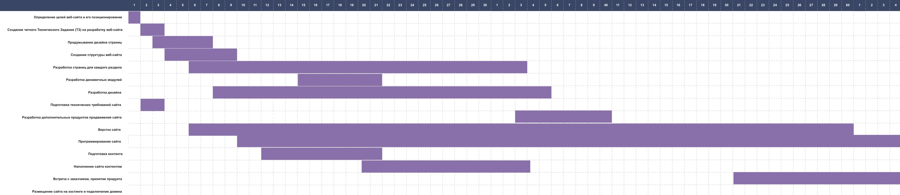

## Диаграмма Ганта

## Риски
+ неправильная оценка задачи
+ риски, связанные с техническим заданием и другими описаниями проекта
+ большие сроки и утрата контакта
+ изменение требований и цена развития
+ реальный объем данных и производительность
